# Feminist Book Review

This site is the Milestone Project 3 for the Software Development 
Diploma course at Code Institute. The project is aimed at displaying
my understanding of Python, micro-framework Flask and MongoDB for
building the back-end functionality for a CRUD (Create, Read, Update
Delete) webite.

A live version of the website can be viewed here.

(Image of the website)

The main purpose of this website is to provide a collection of book reviews
to facilitate the interested reader in finding a book in the genre of feminist
literature that he or she wants to read - and by doing so also spreading this 
literature to more readers. Through the functionality of adding, editing and
deleting book reviews, the site is meant to be a living fora for the reader to
share their thoughts and reflections on different books. The possibility of 
sharing experiences with others works as a motivator for reading and thus learning 
and discovering by exploring new books. In this way, the site aims both to increase
the reading of feminist literature and to build a sense of community around the reading.
To further add to this, a future functionality to add to the site could be some kind
of discussion board for sharing thoughts directly with each other, or to organize 
book clubs and read and discuss together in person or virtually.

### Site goals and user goals

The site goals of this website is to:
* Facilitate finding books in the genre of feminist literature in order to aid in spreading
  this literature to more readers
* Increase reading by motivating readers by giving the opportunity to share their thoughts
  and reflections on books they have read

The clients goals of this website is to:
* Find suggestionsfor feminist books to read
* Get information about what others have thought about different books
* Be able to add books that they have read themselves and to share their thoughts and 
  reflections on them

## UX

### Ideal client

The ideal client for this website is:
* An reader already interested in feminist literature
* A person curious about exploring the genre of feminist literature
* English speaking

Visitors to this site are looking for:
* Finding books to read in the genre of feminist literature
* Sharing their own thoughts and reflections on feminist books that they have read

This project is the best way to help them achieve this because:
* This website provides an easy way to find feminist books reviewed by others, either
  by scrolling a list or by searching
* It provides the possibility for the user to register their own account and register
  and administer reviews of books they have read
* it has a clear and well structured design and is responsive, making it easy for the
  user to find the information they are looking for
* This website is easy to navigate, as it provides navigation options on both top and 
  bottom of the page

### User stories

  1. As a first time visitor, I want to quickly get an overview of what this site is for

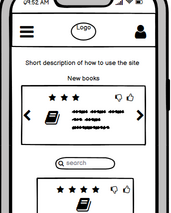
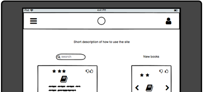
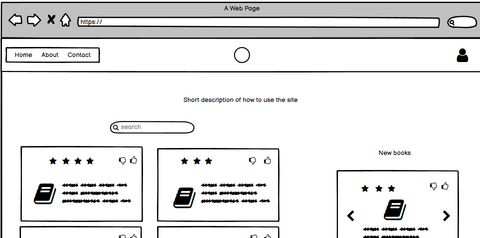

  2. As a user, I want to easily navigate to the different parts of the site and back again

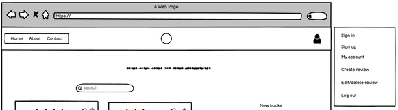
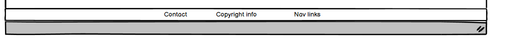

  3. As a user, I want the site to be responsive so that I can easily view and use it on different
     devices

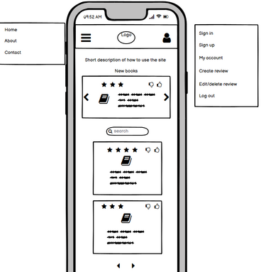
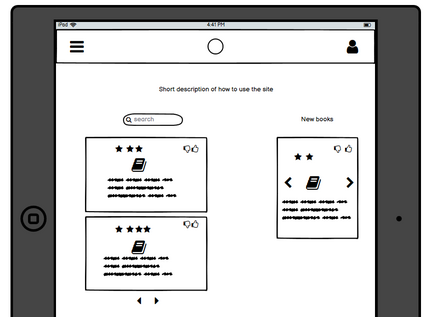
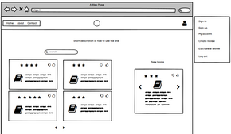

  4. As a user, I want to be able to search for a specific book or author on the site

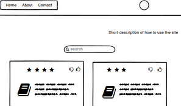

  5. As a user, I want to read the review in an enlarged full-size field of its own so it's not cluttered by other content

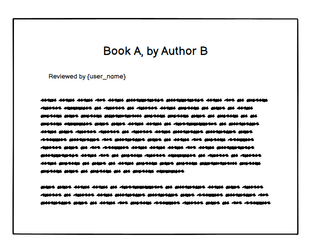

  6. As a user, I want to be able to upvote or downvote books on the site to share my opinion on books reviewed by others

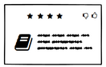

  7. As a user, I want to be able to register my own user account on the site 

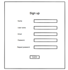

  8. As a registered user, I want to be able to create my own reviews of books I have read

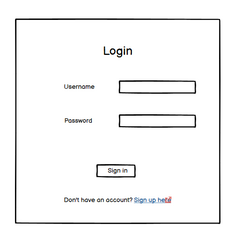

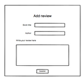

  9. As a registered user, I want to be able to edit or delete my book reviews

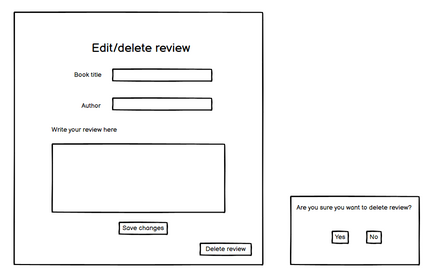

  10. As a user, I want to be able to navigate back to the main site if I end up on a page that doesnt exist, or if a link is broken

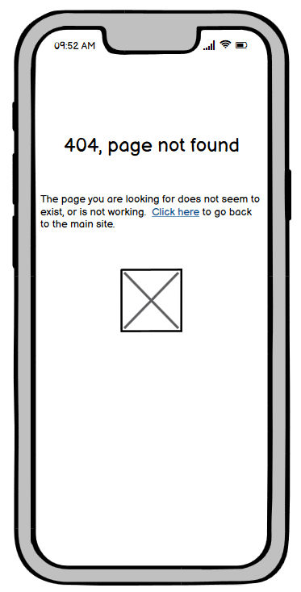
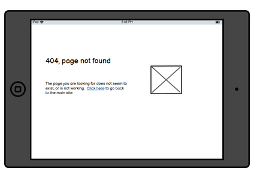
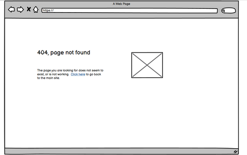

  11. As a user, I want to be able to contact the site owner to report errors on the site or suggest changes or additions to the site

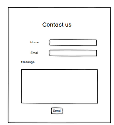

  12. As a returning visitor, I want to see what new books have been added to the site

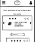

