# Feminist Book Site

This site is the Milestone Project 3 for the Software Development 
Diploma course at Code Institute. The project is aimed at displaying
my understanding of Python, micro-framework Flask and MongoDB for
building the back-end functionality for a CRUD (Create, Read, Update
Delete) website.

[A live version of the website can be viewed here](https://feminist-book-site.herokuapp.com/)

(Image of the website)

The main purpose of this website is to provide a collection of feminist books
to facilitate the interested reader in finding a book in this genre that he or 
she wants to read - and by doing so also spreading this literature to more readers. 
Through the functionality of adding, editing and deleting books, the site is meant to 
be a living fora for the reader to share book-tips and share their own thoughts about different books. 
The possibility of sharing book-tips with others works as a motivator for reading and thus 
learning and discovering by exploring new books. In this way, the site aims both to increase
the reading of feminist literature and to build a sense of community around the reading.
To further add to this, a future functionality to add to the site could be some kind
of discussion board for sharing thoughts directly with each other, or to organize 
book clubs and read and discuss together in person or virtually.

### Site goals and user goals

The site goals of this website is to:
* Facilitate finding books in the genre of feminist literature in order to aid in spreading
  this literature to more readers
* Increase reading by motivating readers by giving the opportunity to share tips on books to read
  and reflections on them to others

The clients goals of this website is to:
* Find suggestions of feminist books to read
* Get information about what others have thought about different books
* Be able to add books that they have read themselves and to share their thoughts and 
  reflections on them

## UX

### Ideal client

The ideal client for this website is:
* An reader already interested in feminist literature
* A person curious about exploring the genre of feminist literature
* English speaking

Visitors to this site are looking for:
* Finding books to read in the genre of feminist literature
* Sharing their own thoughts and reflections on feminist books that they have read

This project is the best way to help them achieve this because:
* This website provides an easy way to find feminist books added by others, either
  by scrolling a list or by searching
* It provides the possibility for the user to add books that they have read
* It has a clear and well structured design and is responsive, making it easy for the
  user to find the information they are looking for
* This website is easy to navigate, as it provides navigation options on both top and 
  bottom of the page

### User stories

  1. As a first time visitor, I want to quickly get an overview of what this site is for so that I can decide 
     if the site provides the services I am looking for

  2. As a user, I want to be able to search for a specific book or books by a specific author on the site

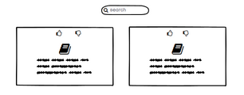

  3. As a user, I want to be able to easily view the books on the site so that I can find an interesting book

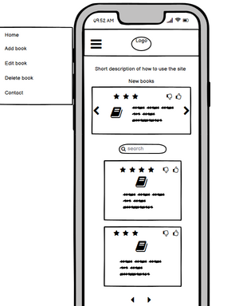
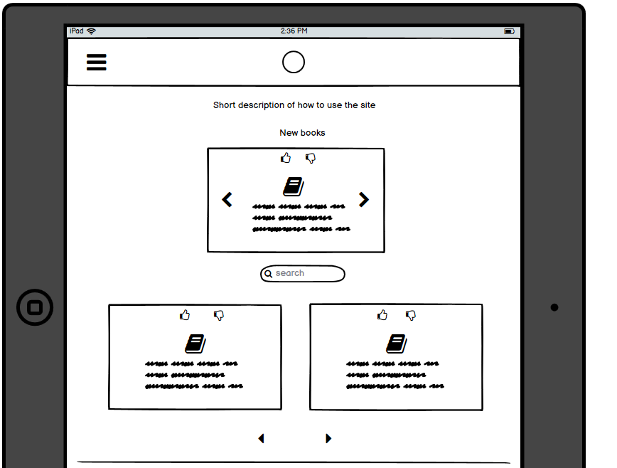
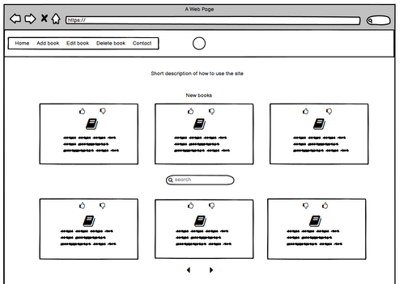

  4. As a returning visitor, I want to see what new books have been added to the site so that I can easily know
     if there has been any interesting additions since my last visit

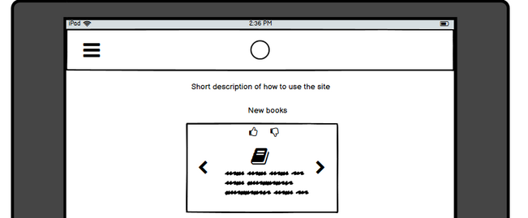

  5. As a user, I want to be able to upvote or downvote books on the site so that I can easily share my opinion on books

  6. As a user, I want to be able to add books I have read so that I can share tips and thoughts with others

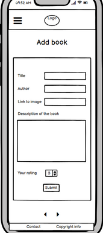

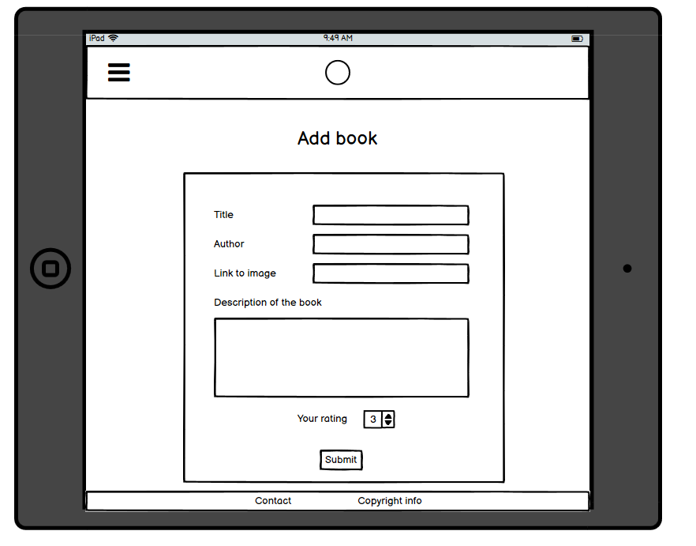

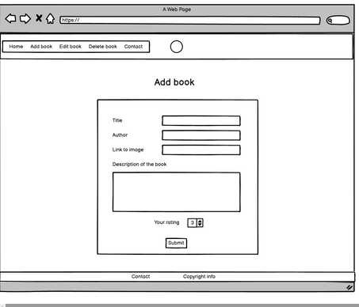

  7. As a user, I want to be able to edit books so that I can correct any mistakes or add more information in the description of the book

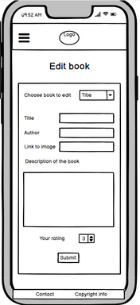

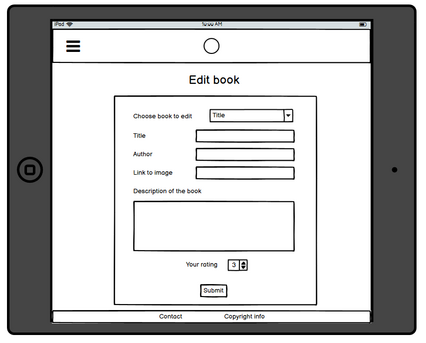

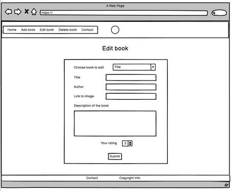

  8. As a user, I want to be able to delete books so that I can remove any books that I believe is not in the right genre for this site

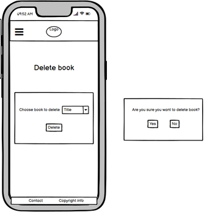

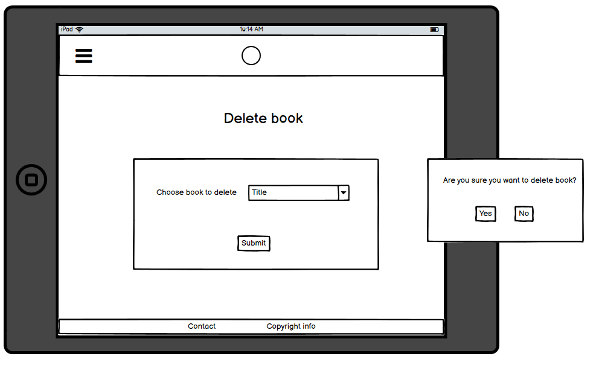

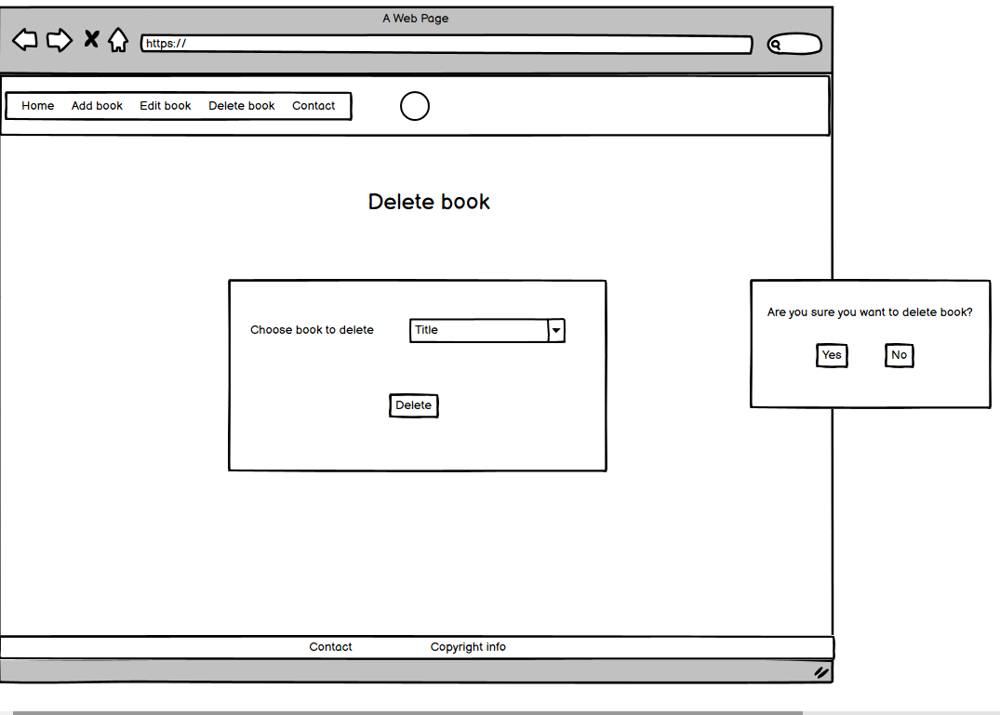

  9. As a user, I want to be able to contact the site owner to report errors on the site or suggest changes or additions to the site

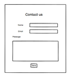

  10. As a user, I want to be able to navigate back to the main site if I end up on a page that doesnt exist, or if a link is broken

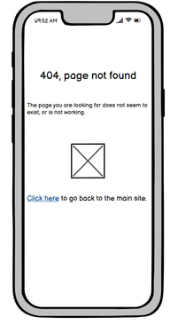
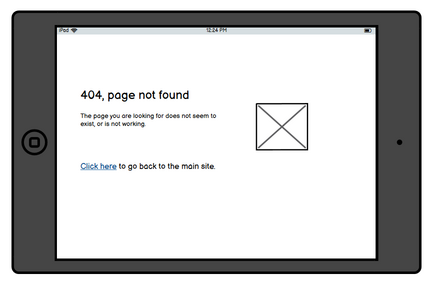
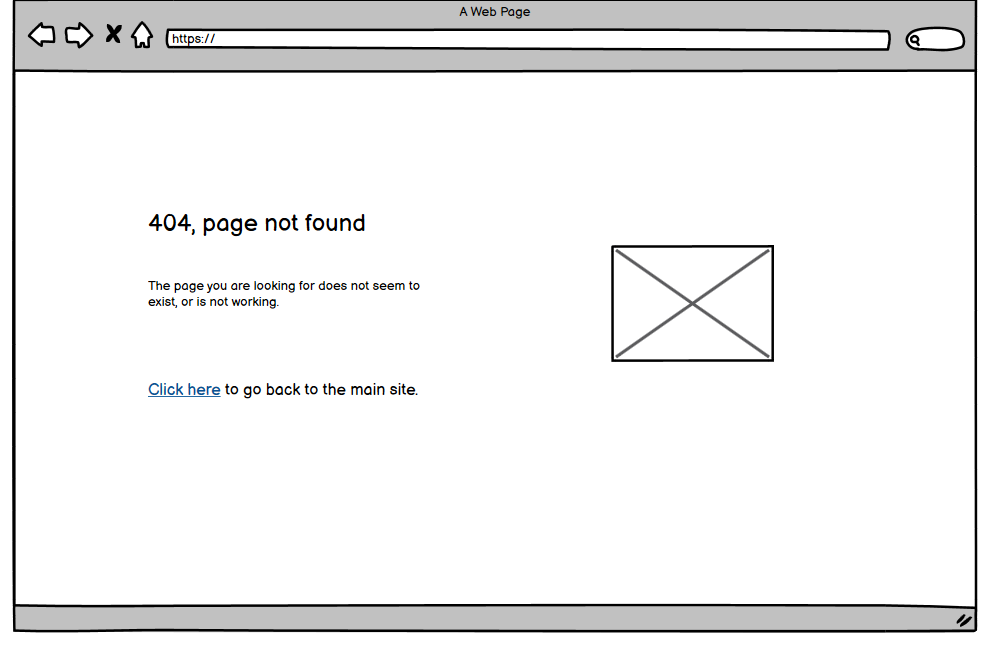

Link to full sized wireframe images:

### Database design

This database design includes a future intended functionality of offering users to register an individual user account.
The user collection is not implemented in this project yet. The "Added_by" in Books collection is therefor not impplemented
yet either.

Examples of MongoDB object formats:

Collection: books
 { _id: unique-value,
   title: "Feminist Book",
   author: "Jane Doe",
   description: "This is a book about some very interesting stuff.",
   rating: 5,
   date_of_adding: 2021-02-20T15:05:55.502+00:00,
   (added_by: session[user])
 }

Collection: user
{ _id: unique_value,
  username: "Admin",
  password: "12&4HLG65!12",
  name: "Mary Poppins"
}

#### Security

An env.py file is used for storing details about database connection, and this file is not uploaded to GitHub. 

### Design

* Color scheme: The background color on the site is an Ivory white (#FFFEF2) , chosen to achieve a very light background but that is still softer on the 
  eye than a purely white background. The ivory nuance also has a warmth that makes it go well together with the other colors on the site.
  The soft pink color Light Coral (FF7474) was chosen to create a warm and feminine feeling and to pick up on the color from the book in the image
  of the woman reading. This was made to ensure that the associations awokened in the viewer from the first section on the page would continue
  when scrolling down to the next section (recently added books). The brighter pink color Amaranth (#E60045) was chosen to be invigorating and to
  create a sensation of modernness, curiousness and also associate to femininity. This color is used on elements that needs to be immideately visible for
  the user to be easily accessible, such as navbar links and submit buttons. The heading elements use a teal color (#004D40) - except for heading in search box, 
  that uses Amaranth for easthatical reasons as to go along with the submit button. The teal green picks up from the color on the leaves from the book 
  image and provides a good contrast for reading the header text, while giving a warmer impression than for example a dark grey hue would. For p elements,
  dark grey color (#444138) is used to provide good contrast for easy readability and to be easy on the eye while reading longer paragraphs of text.

  

* Imagery: The purpose of the images on this site is to create an immediate positive emotional response associated to reading when the user
  enters the site. The images are also chosen to bring about associations to femininity in the choice of colors of the glasses and the book,
  and in the chosen gender of the reading person. This is made to amplify the impression in the user that this site is aimed primarily at 
  women, and of course at feminists of other sexes than female. The image of the reading woman is chosen to give the feeling of concentrated 
  stillness and being completely immersed in something that reading a book can bring. This image is shown on all screen sizes. On screen sizes
  from 992px and up, the images of a pair of pink glasses and a book with the text "With books you can go places!" are also shown. The image
  of the glasses is simply chosen to bring about an associaton with reading in general, and the image of the book is chosen to bring about
  with the feeling of exploring and learning, seeing other worlds, that for many people is associated with reading. The imagery chosen on the
  site is overall aimed at awakening the user's curiousness to find new books and their desire to read. 

* Typography: The font 'PT Serif' is chosen for the H1 headers on the site. The reasoning behind this choice is that firstly, it is a serif font
  which gives it a somewhat serious look and makes it associable to printed text and more precisely books. This font is used for the main headers on each
  page so that the user's first association from the font, upon entering each page, is an association to printed material and books. The second reason for 
  choosing this particular serif font is that it at the same time has rather rounded forms and is not too sharp, and this gives it a more modern and friendly
  look which goes along well with the site's goal of motivating reading, by giving a sense of welcoming to the site. The font chosen for all other headings
  and for text is Poppins. This font was chosen because it has a rounded and friendly design language and is easy to read, which also facilitates in giving
  the site a friendly and welcoming sense to it. 

### Features

Navigation bar and logo is present of every page on the site for easily accessible navigation.
On smaller screens, the navigation bar is displayed as a hamburger menu, showing nav links when being
clicked, which is to ensure responsiveness. All pages on the site also contains a footer with copyright
info.

#### Index page

At the top of the index page is a header and a subheader that explains what this page is for, so that the user
can quickly decide if this page provides the functionality that they are looking for.
The index page contains the main content of the site, which is the books, and those are displayed on cards
arranged in a simple and responsive grid system to make it easy for the user to get an overview of the books.  
The user can find books by scrolling through the cards and exploring what books are there to be found. A user that 
knows which book or author they are looking for can also use the search bar on the page to find that book, or books by that author. 
Present on the index page is also a slider showing the three latest books that have been added to the site, so that the returning 
visitor can easily see what books have been added since they visited last time. The purpose of all features on the index page is to
make the site easy to use and thus facilitating for the user to find new books to read. At the bottom of the index page is also nav
links in the shape of icons, providing easily accessible navigation back to the top of the page, to the add book page and to the 
contact page, respectively. The purpose of providing icons for nav links is to make it easy for the user to immediately see these 
navigation options and understand what they are for. 

#### Add book page
The add book page is accessed through the navigation bar at the top of the page or the nav icons at the bottom of the index page.
The add book page contains a form for the user to fill out to add a new book to the site. The form provides fields for book title, author,
rating and description of book. When the user fills out the form and clicks the submit button, they are taken back to the index page where
a flash message is displayed, saying "You successfully added a book". 

#### Edit book page
On each of the cards displaying a book, there is an icon with a text underneath saying "Edit book". When the user clicks this icon link they
are taken to a separate page with an edit form. The form is prefilled with the current information about the book that the user clicked the
navigation icon on. At the top of the edit page is a header explaining that this page is for editing a book, and each input field has a label
explaining which information about the book is contained in that field. The purpose of this is to make it easy for the user to understand how
to use the form for editing a book, so that the user easily can share their own input on the book if they for information spot a spelling mistake
on one of the books on the site. This facilitates user interactivity and thereby enforces the site's goal of creating motivation to read by 
facilitating sharing input. 

#### Delete book modal
On each of the cards displaying a book, there is an icon with a text underneath saying "Delete book". When the user clicks this icon link 
a modal pops up saying "Are you sure you want to delete this book?" and explaining to the user that deleting the book will remove it 
permanently. The modal contains one button with the text "yes" and one with the text "no". Clicking the "yes"-button returns the user to 
the index page where at the top a flash message is displayed, saying "The book was successfully deleted". Clicking the "no" button just returns
the user to the index page.

#### Contact page
The contact page is accessed through the navigation bar at the top of the page or the nav icons at the bottom of the index page. The contact
page contains a form where the user fills out their name, emailadress and the message they want to send. There is a header and a subheader
present on the top of the site, explaining clearly that this is a contact form, and there are labels and placeholders on all fields in the 
form explaining what information should be added there. This is made to make the form easy to understand and use for the user. On clicking 
the send button, an email is sent through Emailjs' email service. After the send button is clicked, the user sees either the message "Your 
mail has been successfully sent!" or "Your email was not sent, please try again". 

## Credits

### Technologies used

* This site is built with HMTL, CSS, JavaScript and Python languages

* [jQuery](https://jquery.com/) was used for simplifying the use of Javascript

* [Materialize framework](https://materializecss.com/) was used for easy implementation of grid systems, styling, navbar and carousel

* [Picresize.com](https://picresize.com/) was used to resize images

* [Logo created in Canva tool](https://www.canva.com/)

* [Favicon.io](https://favicon.io/) was used for converting logo image to favicon

* [Unicorn Revealer Tool](https://chrome.google.com/webstore/detail/unicorn-revealer/lmlkphhdlngaicolpmaakfmhplagoaln?hl=en-GB)

* [WC3 Markup Validation Tool](https://validator.w3.org/) for validating HTML code

### Code

* [Code for passing the date of adding a book to the database](https://kb.objectrocket.com/mongo-db/how-to-insert-a-document-into-a-mongodb-collection-using-python-367#add+the+date+and+time+in+python+when+you+insert+mongodb+documents)
* [Code for querying the db for 3 most recently added books](https://api.mongodb.com/python/2.0/tutorial.html)
* [Code for creating upvote/downvote functionality](https://codepen.io/hilaura13/pen/ztmpf)
* [Code for keeping footer in place on every page, regardless of the size of the page content](https://www.freecodecamp.org/news/how-to-keep-your-footer-where-it-belongs-59c6aa05c59c/)
* [Code for navigation back to specifik part of page after executing search](https://stackoverflow.com/questions/35843675/link-to-a-specific-location-in-a-flask-template)

