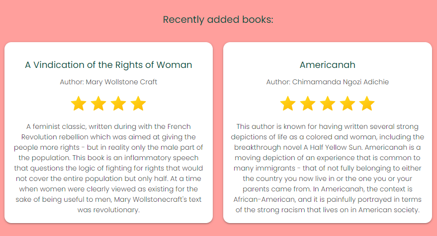
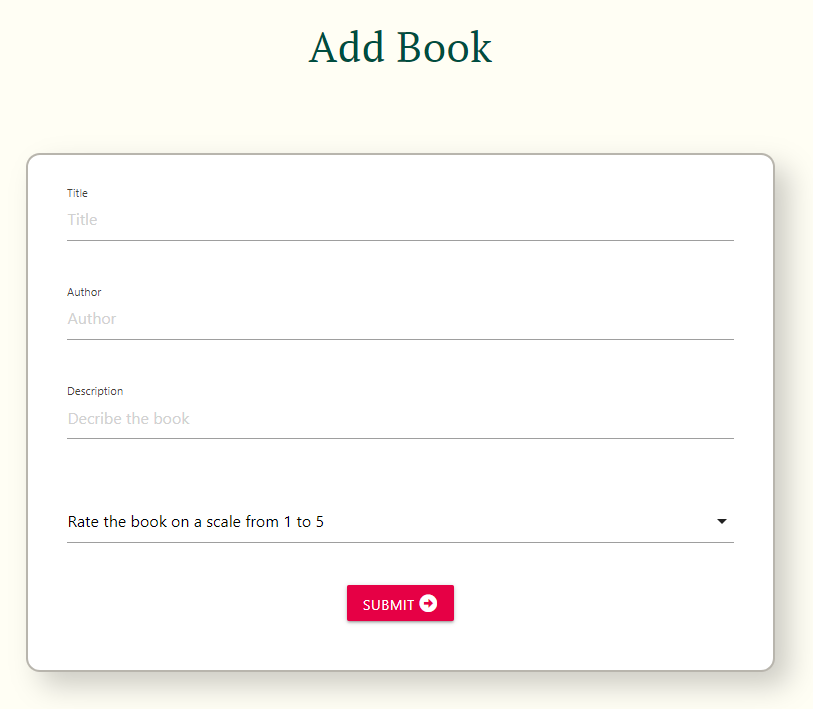
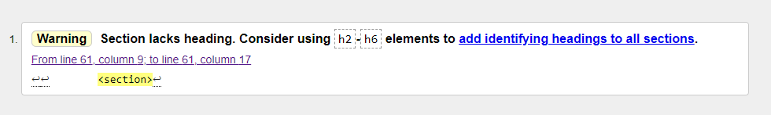
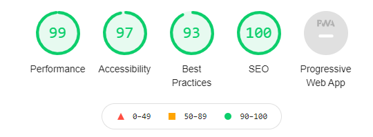
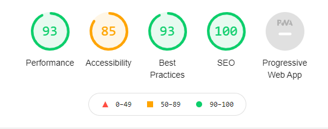

# Milestone Project 3 - Feminist Book Site - Testing details

## Testing

The site has been manually tested on the functionality of the following:

* Navigation links: 
   - Links in navigation bar 
   - Links in navigation bar logo 
   - Links to edit and delete book on book cards 
   - Navigation link icons at the bottom of index page

* Add book form: 
   - Input fields requirement functioning
   - Book being added to database upon submission of form
   - Sending back to index page and displaying flash message after form submission

* Edit book form:
   - Info of the correct book being shown prefilled in the edit field 
   - Book being edited in the database upon submission of form
   - Sending back to index page and displaying flash message after form submission

* Delete book functionality:
   - Popup modal showing when delete button is being clicked - displaying message "Are you sure you want to delete this book?"
   - The correct book being deleted from the database when "Yes" button is clicked in the pop up modal
   - Sending back to index page and displaying flash message after clicking "Yes" button
   - Sending back to index page without flash message and with book not being deleted when clicked "No" button in pop up modal

* Search field:
   - The functionality of entering a search string and pressing search returning a result
   - If the book or author searched for is present on the site, the book card or cards are displayed below the search field
   - If the book or author does not exist on the site a message is displayed below the search field saying "No results found"

* Contact form sending emails and displaying a feedback message confirming that the email has been sent

* Responsivity on different devices has been tested using Chrome Developer Tools and on different devices (mostly different models of
  iPhone) with the help from family and friends.

## User stories Testing

  1. As a first time visitor, I want to quickly get an overview of what this site is for so that I can decide 
     if the site provides the services I am looking for

     * When the user enters the site, they see a header and a subheader explaining the purpose of the site. The first section of
       the site also shows images and colors chosen to make the user associate to reading and to feminism, which facilitates the 
       users understanding of the site's purpose. 

  

  2.  As a user, I want to be able to search for a specific book or books by a specific author on the site

      * There is a search field present on the site, where the user can enter a book title or author and search for them on the site

  

  3.  As a user, I want to be able to easily view the books on the site so that I can find an interesting book

      * There is a secton on the page displaying all books in a grid that is easy to overview to see what books are presented on the site

   

  4. As a returning visitor, I want to see what new books have been added to the site so that I can easily know if there has been any interesting 
     additions since my last visit

     * On the index page, just below the first section is a section for recently added books, where the user can immediately see the two books that
       have been addest latest to the site

     

  5. As a user, I want to be able to upvote or downvote books on the site so that I can easily share my opinion on books

    * On each book there is an upvote button and a downvote button that the user can click and that triggers a count up or down that is being showed
      between the buttons

     

  6. As a user, I want to be able to add books I have read so that I can share tips and thoughts with others

    * There is an add book form accessible from navigation bar at the top pf the page and from navigation links at the bottom of the page. The user can
      fill out the form and submit it to add a book to the site

    

## Further Testing

### Validation

HTML code has been validated using the [WC3 Markup Validation Tool](https://validator.w3.org/) with one error stemming from the jinja templating:

#### Comment:
This error is thrown because there is no flash message showing on the page, and therefor the template for flash messages is currently empty - leading to lack of
heading in the section. The HTML has been validated using the code from deployed page (by right-clicking the page and choosing the option 'show page source'),
because in the deployed version the templates are filled and therefor not throwing errors stemming from empty templates, such as '!Doctype missing' for example.

CSS code has been validated using the [Jigsaw Validator Tool](https://jigsaw.w3.org/css-validator/)

### Usability and performance testing

The site has been evaluated using Lighthouse Tool, with the following result:

#### Index page:

#### Add book page:

#### Contact page:

#### Edit book page:

#### Comments on results:

The lower results on accessibility for add book page and edit book page is due to an additonal input element in materialize code, that lacks a label for it. 
This could not be solved since adding a label to this materialize element overwrote the label for the option element in the html form.

## Known bugs

## Solved bugs

* The upvote/downvote function on the book cards had a bug where no matter on which card the Upvote or Downvote button were clicked, the count always
  changed on the first book card only. When the HTML code was first run in the validator, it threw an error saying that the id's "upVote" and "downVote"
  where not unique. This led me to acknowledge that since the book card with the id's of "upVote" and "downVote" where present for every book card loaded
  via the template route, the id's where indeed present several times on the page. This meant that the voting function being called when clicking an "upVote"
  or "downVote" function on any of the cards on the page always sent back the count to the first element with the id "count" on the page, and this was the reason 
  why only the count on the first book card changed when clicking an "upvote" or "downvote" button on any card. The bug was solved by removing the id's from "upvote"
  and "downvote" buttons an giving them classes instead (solving the issue of html validator throwing error for id's not being unique), and using the 'this' keyword
  and traversing in the jquery code for sending back the count to the sibling span element of the button being clicked. The solution was found with assistance from
  tutor support.   

* The nav link to the contact page was not working on some screen sizes, where clicking the link directed back to the index page. A quick look with the 
  [Unicorn Revealer Tool](https://chrome.google.com/webstore/detail/unicorn-revealer/lmlkphhdlngaicolpmaakfmhplagoaln?hl=en-GB) showed that the a tag 
  containg the logo was overlapping the contact link on some screen sizes. This problem was solved by setting a smaller width to the a tag with the logo.

* During development of the functionality of editing and deleting books, while setting up forms and templates on edit_book.html and delete_book.html,
  an error with navigation occured. All navigation links had been working properly up to this point, but clicking on the links to these pages now 
  returned a jinja template error: " TypeError: delete_book() missing 1 required positional argument: 'book_id' ". The error was found to occur because 
  the route function being called in the nav link - @app.route("delete_book") - required a value for book_id since the function needs to know which book
  to delete. And the same was true for the editing page and route. When navigating to the pages for editing and deleting books, there of course was no 
  specific book_id value to input since the page needed to load all books in the db. This problem was solved by creating two separate routes for navigation
  to the edit_book site and the delete_book site respectively, and retrieving all books from the db for the user to choose from. 

* On some screen sizes, the book card grid had an issue where the cards don't fit on the second line and there for overflow into the end of lione two and on to
  line three. See image below:

  [Image of the issue](./static/images/grid-issue.png)

  This issue was caused by the book cards not being equal in height, which led to some of them taking up more place vertically and therefor pushing away the content 
  on the line below. This could be fixed with setting a fixed maximum height on the cards, but at the expense of either cutting off the content or using a scroll bar
  on the cards with longer content. To solve this, another div was wrapped around the card div, and a fixed max-height was set to this wrapper div on small devices
  and a fixed height was set from medium devices and up. The reason for using max-height on small devices is that it worked better with the one-column grid used there.
  This is what the grid looks like after this fix:

  [Image of grid after fixing issue](./static/images/grid-fixed)
